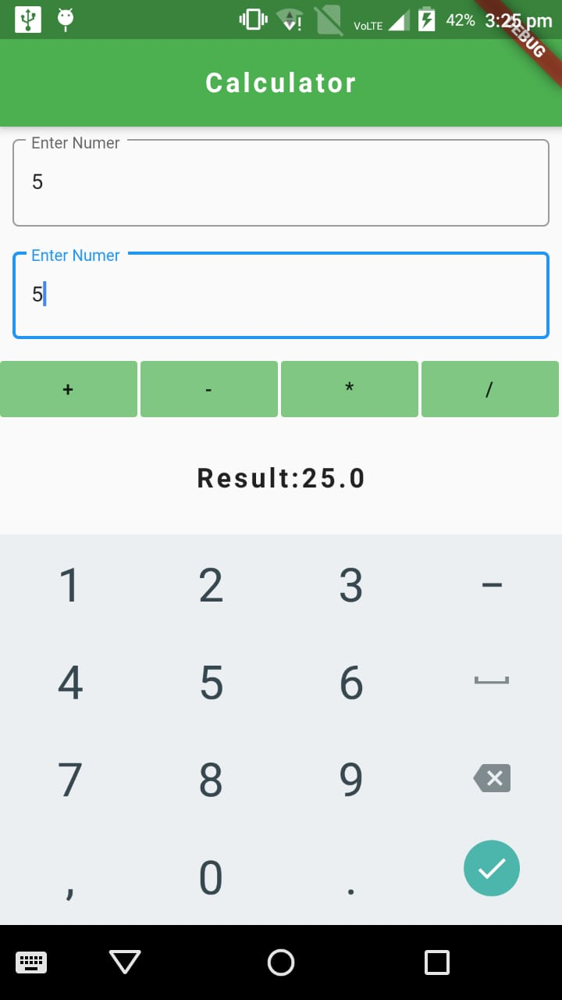

# Flutter_calculator
### create manually the flutter project and delete the test folder as of now.
### paste this main.dart file in the lib folder. 
### Just replace main.dart file with my main.dart file and u will get the output by running the project.
# Images

